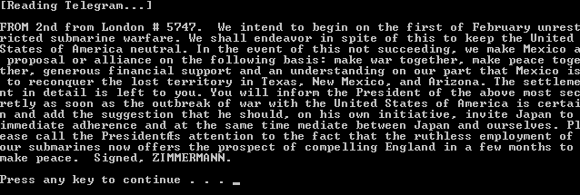
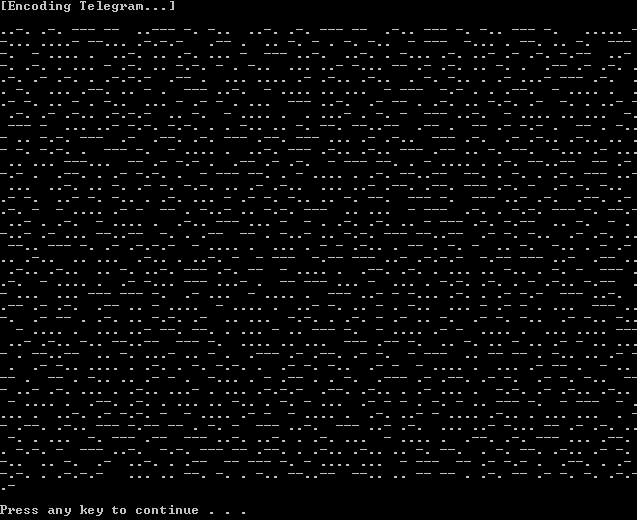
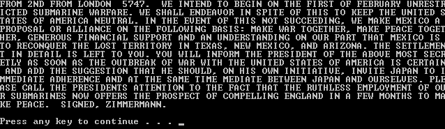
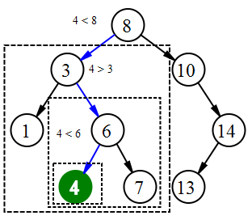

# Morse Code: A Binary Search Tree

  

# Description
This program creates a Telegraph object that is used to encode/decode a text file using a binary search tree. This node-based data structure can be defined as having a left sub-tree that contains only nodes with keys less than the node's key and a right sub-tree that contains only nodes with keys greater than the node's key. Both sides of the tree must also be binary search trees. This allows the tree to be searched through an iterative or recursive process which makes it an efficient data structure for searching, sorting, or in-order traversal.

The program has two structures that are used to store and call the encoded/decoded text. Struct LNODE represents the node of the encoding list and is used to store a character and its associated Morse code. Struct TNODE represents a node of the decoding tree and is used to store the code for each character. An INSERT function inserts a symbol and its associated Morse code into the encoding list and decoding tree. Each Morse code character corresponds to a path in the tree from the root to a node. If a “dot” is encountered traversal goes left, if a “dash” is encountered traversal goes right. The node at the end of the path holds the symbol for that character.

I decided to use the famous [Zimmerman Telegram](https://en.wikipedia.org/wiki/Zimmermann_Telegram) for the example text.

# Screenshots

## Original Text

  

## Morse Encoded Text

  

## Decoded Text

  

## Binary Search Tree

  

# Copyright

This project is distributed under the **MIT License**. Please see the included **COPYRIGHT** and **LICENSE** for more information.